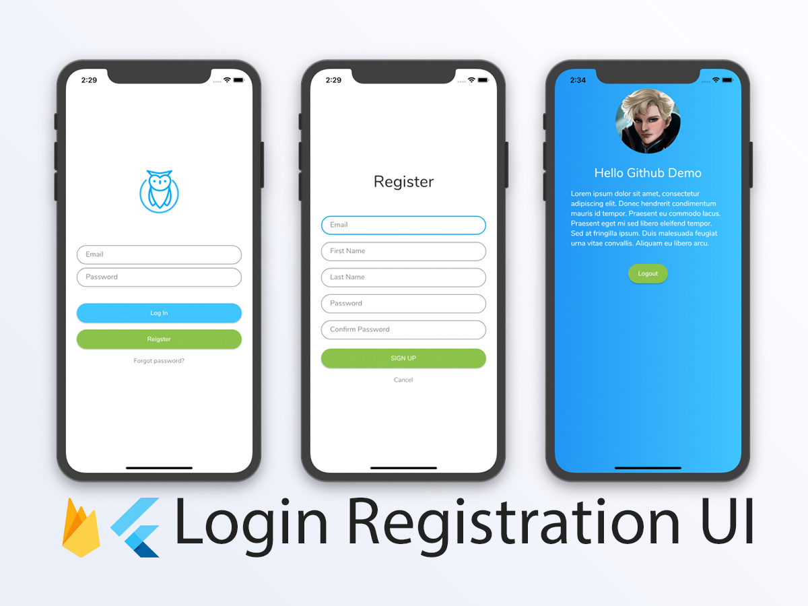

# Flutter Firebase Login Registration UI

A clean and simple login UI and registration with a basi chero animation in Flutter, a mobile sdk framework by Google. This project is based off of [flutter-login-ui](https://github.com/putraxor/flutter-login-ui) and is designed to kick start flutter application development for those using Flutter.

[][mitLink]

## Features
This project is a starting point for Flutter applications with services using Firebase.

- Email and Password Login
- Registration with Email and Password.
- Stores user information on successful registration.
- Fetches down user information on successful login.
- Basic error validation.

## Setup
In order to properly use this for your own Firebase application, create a new application at: [https://firebase.com](https://firebase.com). Follow the remainder of the setup instructions for updating the configurations at [https://firebase.google.com/docs/flutter/setup](https://firebase.google.com/docs/flutter/setup).

## License

`Flutter Firebase Registration UI` is released under an [MIT License][mitLink]. See `LICENSE` for details.

**Copyright &copy; 2019-present Kevin J Nguyen.**

*Please provide attribution, it is greatly appreciated.*

[mitLink]:https://opensource.org/licenses/MIT